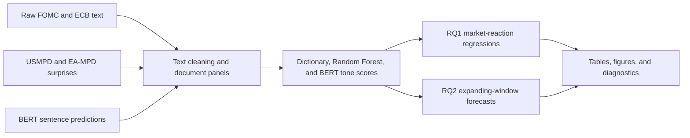
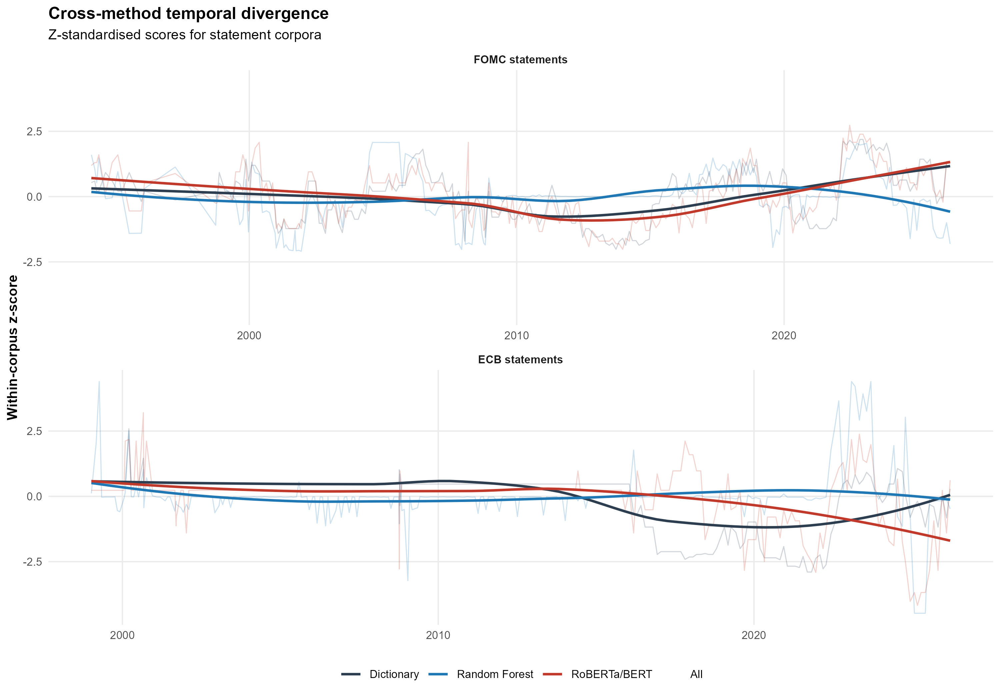
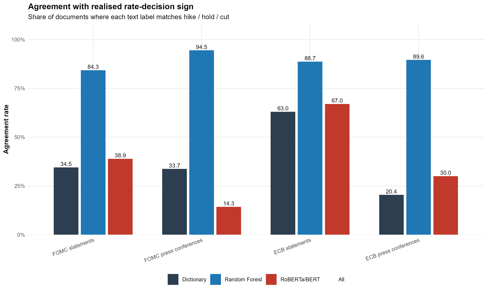
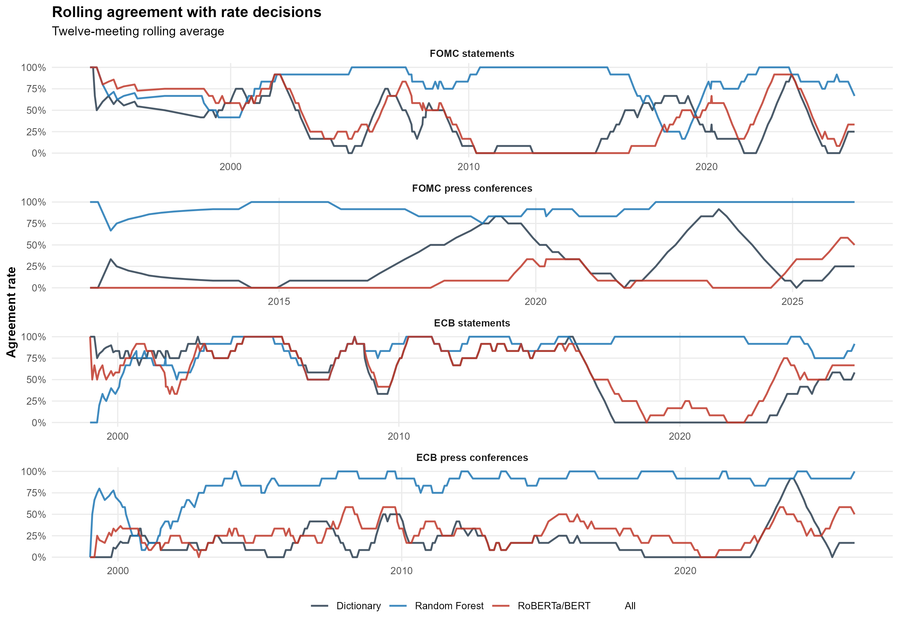
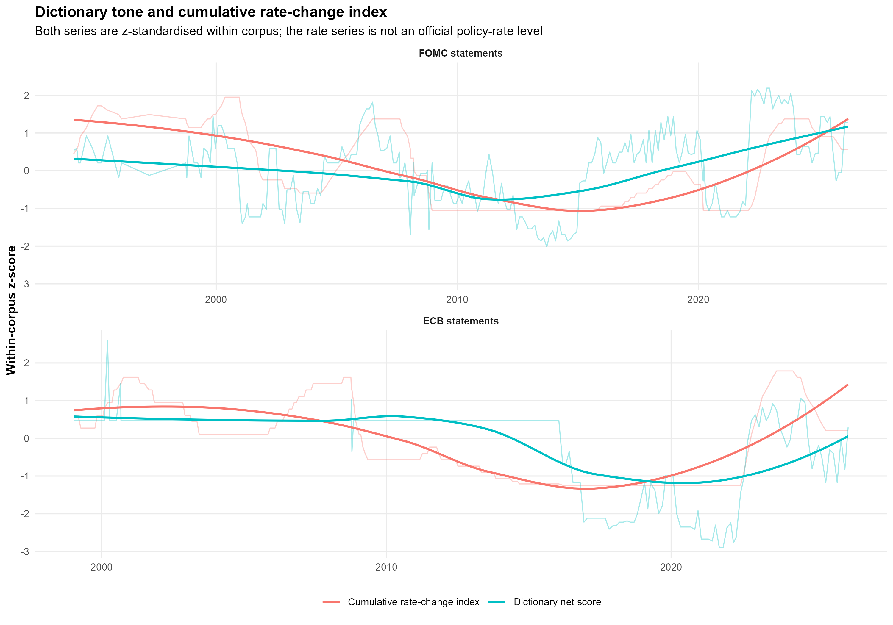

# Central Bank Communication and Market Reactions

This repository is the public artifact archive for the thesis:

**Central Bank Communication and Market Reactions: Text-Based Hawk/Dove Classification and Event-Study Evidence from the FOMC and ECB**

It collects the final v31 data, model objects, code, tables, and figures used to study whether the tone of central bank communication helps explain financial market reactions and predict near-term policy outcomes.

Authors: Adrian Piotr Pulchny and Kajetan Moravec Cvelbar  
Institution: Copenhagen Business School, MSc in Advanced Economics and Finance  
Artifact version: v31, assembled on 2026-05-14

## At A Glance

The project compares three ways of measuring monetary policy tone across FOMC and ECB statements and press conferences:

| Method | Role in the thesis | Main outputs |
| --- | --- | --- |
| Dictionary score | Transparent hawkishness measure built from policy, inflation, employment, and residual-risk language | `net_score`, component scores, dictionary labels |
| Random Forest score | Supervised bigram model trained to recover rate-decision language | `rf_score`, feature importance, confusion matrices |
| RoBERTa/BERT score | Sentence-level neural benchmark aggregated to document level | `bert_score`, BERT labels, method comparison tables |

These measures are merged with intraday market surprises from USMPD and EA-MPD, then evaluated in event-study regressions and expanding-window forecast exercises.

## Workflow



## Visual Preview

The figures below are selected from the final v31 output set and focus on diagnostics and method comparisons.

### Diagnostics And Method Comparisons

| Cross-method divergence | Method agreement by corpus |
| --- | --- |
|  |  |

| Rolling agreement | Tone and rate overlay |
| --- | --- |
|  |  |

## Repository Map

```text
code/                 R scripts for the final v31 pipeline, figure generation, and data checks
data/raw/             Raw FOMC, ECB, USMPD, EA-MPD, recovery, and BERT sentence-prediction files
data/processed/       Final v31 event-level datasets and score panels
data/cache/           Cached ECB HTML recovery object used by the pipeline
models/               Saved Random Forest model and expanding-window result objects
results/tables/       Main result tables and diagnostics from the v31 run
results/figures/      Final generated thesis figures
results/figure_data/  CSV data behind the generated figures
results/review_checks/Additional review and robustness diagnostics
docs/                 Selected thesis chapters and appendix material
```

## Key Files

| Artifact | Path |
| --- | --- |
| Main processed panel | `data/processed/combined_final_v2.csv` |
| Final RQ1 Random Forest object | `models/rf_rq1_models_v31.rds` |
| Final RQ2 expanding-window object | `models/rf_rq2_xw_results_v31.rds` |
| RF performance | `results/tables/rf_rq1_performance_v31.csv` |
| RF feature importance | `results/tables/rf_feature_importance_v31.csv` |
| RQ1 method comparison | `results/tables/rq1_method_comparison_v31.csv` |
| RQ2 method comparison | `results/tables/rq2_method_comparison_v31.csv` |
| Figure manifest | `results/figure_data/00_figure_manifest.csv` |

## Raw Data Included

The raw folder from the thesis workspace is included under `data/raw/`, including:

- FOMC statement and press-conference econometric text files
- ECB decision and statement or press-conference files
- USMPD and EA-MPD Excel workbooks
- BERT sentence-level prediction files
- Manual text-recovery file

Only the two zero-byte Excel lock files, `~$EA-MPD.xlsx` and `~$USMPD.xlsx`, were excluded.

## Reproduction Notes

The final outputs are already stored in this repository. The scripts in `code/` are included for transparency and reruns.

- `code/pipeline_v31_final.R` reads from `data/raw/` and writes rerun outputs to `reproduction/output_v31/`.
- `code/generate_v31_figures_full_FIXED_PATHS.R` reads from `data/processed/` and `results/tables/`, then writes regenerated figures to `reproduction/figures_v31/`.
- `code/data_chapter_checks_FIXED_V5.R` reads from `data/raw/` and writes checks to `reproduction/data_check/`.

The full RF/BERT pipeline can take several hours and requires the R packages loaded at the top of the scripts.

## Important Caveat

The v31 outputs are the final thesis artifacts identified in the local working folder. A later review check identifies several RF leakage-adjacent terms in `results/review_checks/10_rf_leakage_adjacent_terms.csv` and suggests blocklist additions in `results/review_checks/11_suggested_blocklist_additions_from_v31.csv`. Those files are diagnostic. The full RF pipeline was not re-run after that suggested expanded blocklist.

## Citation

If you use this archive, please cite the repository metadata in `CITATION.cff`.

## Licenses

Code is released under the MIT License. See `LICENSE-CODE`.

Data, figures, tables, and documentation are released under Creative Commons Attribution 4.0 International. See `LICENSE-DATA`.
